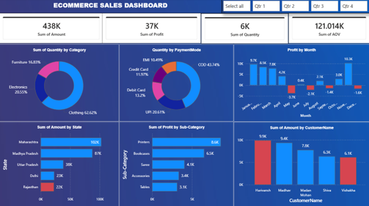

# E-Commerce Sales Dashboard 📊

A comprehensive business intelligence dashboard analyzing e-commerce sales performance across multiple dimensions including product categories, geographical regions, payment methods, and customer segments.



## 📋 Project Overview

This data analytics project transforms raw transactional data into actionable business insights through interactive visualizations and comprehensive analysis. The dashboard provides stakeholders with real-time visibility into sales operations, enabling data-driven decisions across product strategy, marketing campaigns, inventory management, and customer relationship initiatives.

### Key Metrics
- **Total Revenue:** ₹61K
- **Total Profit:** ₹8K
- **Profit Margin:** 13.1%
- **Total Quantity Sold:** 751 units
- **Average Order Value:** ₹16.424K
- **Total Orders:** 500+

## 🎯 Project Objectives

1. Provide real-time visibility into sales performance across multiple dimensions
2. Identify high-performing and underperforming product categories
3. Analyze geographical sales distribution and regional opportunities
4. Understand customer payment preferences and their impact on sales
5. Track profit trends and identify seasonal patterns
6. Enable data-driven decision making for inventory and marketing strategies

## 📊 Dashboard Features

### 1. KPI Cards
Four primary metrics displayed prominently:
- Sum of Amount (₹61K)
- Sum of Profit (₹8K)
- Sum of Quantity (751 units)
- Average Order Value (₹16.424K)

### 2. Quantity by Category (Donut Chart)
Product category distribution:
- **Clothing:** 9.19% (Dominant category)
- **Electronics:** 2.51%
- **Furniture:** 1.67%

### 3. Quantity by Payment Mode (Donut Chart)
Payment method preferences:
- **COD:** 5.95% (Most preferred)
- **UPI:** 2.69%
- **Debit Card:** 1.99%
- **EMI:** 1.42%
- **Credit Card:** 1.32%

### 4. Profit by Month (Column Chart)
Monthly profitability trends:
- **Peak:** April (₹10.3K)
- **Strong Performers:** February (₹8.5K), March (₹7.8K)
- **Challenges:** Q4 losses and January (-₹3.7K)

### 5. Amount by State (Bar Chart)
Geographical revenue distribution:
- **Maharashtra:** ₹14K (23% of total revenue)
- **Madhya Pradesh:** ₹10K
- **Uttar Pradesh:** ₹10K
- **Delhi & Rajasthan:** ₹2K each

### 6. Profit by Sub-Category (Bar Chart)
Sub-category profitability:
- **Printers:** ₹1.8K (Most profitable)
- **Bookcases:** ₹1.6K
- **Saree:** ₹1.4K
- **Accessories:** ₹0.9K
- **Tables:** ₹0.2K

### 7. Amount by Customer Name (Bar Chart)
Top customer analysis:
- **Harivansh:** ₹9.9K
- **Madhav:** ₹9.9K
- **Madan Mohan:** ₹7K
- **Shiva:** ₹5K
- **Vishakha:** ₹5K

## 💾 Data Sources

The analysis is based on two primary datasets:

### Orders.csv
Contains 500 order records with:
- Order ID
- Order Date
- Customer Name
- State
- City

### Details.csv
Contains 1,502 transaction line items with:
- Order ID
- Amount
- Profit
- Quantity
- Category
- Sub-Category
- Payment Mode

## 🔍 Key Insights

### Product Performance
- Clothing dominates sales volume with 9.19% of total quantity
- Printers emerge as the most profitable sub-category (₹1.8K)
- Furniture shows lowest quantity share (1.67%) but Bookcases contribute significantly to profit

### Payment Behavior
- COD preference (5.95%) indicates trust concerns or demographic preference
- UPI adoption at 2.69% shows growing digital payment acceptance
- Low credit card usage (1.32%) suggests opportunity for credit-based promotions

### Temporal Trends
- April peak performance (₹10.3K) suggests successful seasonal campaigns
- Q4 losses (October-December) indicate need for improved year-end strategy
- Mid-year stability (May-September) provides baseline for performance expectations

### Geographical Distribution
- Maharashtra concentration (23% of revenue) suggests strong urban market presence
- Top 3 states contribute 56% of total revenue (concentration risk)
- Delhi and Rajasthan underrepresentation reveals untapped potential

### Customer Segmentation
- Top 2 customers each contribute ₹9.9K (high-value customer concentration)
- Diverse customer spending indicates different value propositions needed
- Opportunity for VIP loyalty program development

## 💡 Strategic Recommendations

### Product Strategy
1. Expand Printer inventory and create promotional bundles
2. Develop cross-selling strategies between Printers and Accessories
3. Investigate Tables sub-category underperformance
4. Leverage Clothing volume dominance with margin improvement

### Payment & Financial Strategy
1. Introduce COD-to-digital migration incentives (discounts, cashback)
2. Partner with credit card companies for exclusive offers
3. Promote EMI options for Electronics (suitable for ₹16.4K AOV)
4. Implement UPI-specific promotions to capitalize on adoption trend

### Geographical Expansion
1. Strengthen Delhi presence through targeted marketing campaigns
2. Replicate Maharashtra success model in tier-2 cities
3. Diversify geographical concentration to reduce dependency
4. Analyze local preferences in MP and UP for product customization

### Seasonal Strategy
1. Launch Q4 revival campaign to address losses (-₹5.1K total)
2. Replicate April success factors in other months
3. Implement festive season strategies for January
4. Maintain mid-year momentum through consistent investment

### Customer Retention & Growth
1. Develop VIP loyalty program for top customers
2. Create personalized communication and exclusive offers
3. Implement referral program leveraging satisfied customers
4. Analyze purchase patterns for upselling opportunities

## 🛠️ Technical Implementation

### Tools & Technologies
- **Visualization Tool:** Power BI / Tableau / Excel
- **Data Format:** CSV files
- **Chart Types:** Donut charts, Bar charts, Column charts, KPI cards
- **Design:** Professional dark blue color scheme (#1F4E78)

### Design Principles
- Hierarchical information architecture with KPIs at top
- Interactive filters enabling dynamic data exploration
- Responsive layout optimized for desktop and presentations
- Consistent chart formatting with clear labels and legends

### Data Relationships
- Order ID serves as primary key linking Orders and Details tables
- One-to-many relationship: One order → Multiple line items
- Geographical hierarchy: State → City (drill-down analysis)
- Product hierarchy: Category → Sub-Category

## 📁 Project Structure

```
ecommerce-sales-dashboard/
│
├── data/
│   ├── Orders.csv                 # Customer and order information
│   └── Details.csv                # Transaction line items
│
├── dashboard/
│   └── dashboard_preview.png      # Dashboard screenshot
│
├── reports/
│   └── E-Commerce_Sales_Dashboard_Report.docx
│
└── README.md                      # Project documentation
```

## 🚀 Getting Started

### Prerequisites
- Data visualization tool (Power BI / Tableau / Excel)
- CSV data files

### Installation & Setup
1. Clone the repository
```bash
git clone https://github.com/yourusername/ecommerce-sales-dashboard.git
cd ecommerce-sales-dashboard
```

2. Load the data files
   - Import `Orders.csv` and `Details.csv` into your visualization tool
   - Establish relationship between tables using Order ID

3. Create visualizations
   - Follow the dashboard structure outlined in the project documentation
   - Apply the recommended color scheme and design principles

## 📈 Expected Outcomes

Implementation of the strategic recommendations is projected to:
- **Improve overall profitability:** 15-20% increase
- **Expand market reach:** 25% growth within next fiscal year
- **Enhance customer retention:** Through targeted loyalty programs
- **Optimize inventory management:** Based on category performance insights

## 📊 Data Dictionary

| Field Name | Data Type | Description |
|------------|-----------|-------------|
| Order ID | Text | Unique identifier for each order |
| Order Date | Date | Date when the order was placed |
| Amount | Currency | Total transaction value in Indian Rupees |
| Profit | Currency | Net profit after costs |
| Quantity | Integer | Number of units sold |
| Category | Text | Product category (Clothing, Electronics, Furniture) |
| Sub-Category | Text | Detailed product classification |
| PaymentMode | Text | Payment method used (COD, UPI, Credit Card, etc.) |
| State | Text | Indian state where order was placed |
| CustomerName | Text | Name of the customer |

## 📝 Glossary

- **AOV (Average Order Value):** Total revenue divided by number of orders
- **COD:** Cash on Delivery - payment made at time of delivery
- **UPI:** Unified Payments Interface - instant digital payment system
- **EMI:** Equated Monthly Installment - payment in equal monthly amounts
- **KPI:** Key Performance Indicator - measurable value demonstrating effectiveness

## 👨‍💻 Author

**Sayam Batra**
- Data Analyst
- Focus: Business Intelligence & Analytics

## 📄 License

This project is open source and available under the [MIT License](LICENSE).

## 🤝 Contributing

Contributions, issues, and feature requests are welcome! Feel free to check the [issues page](https://github.com/yourusername/ecommerce-sales-dashboard/issues).

## 📞 Contact

For questions or feedback, please reach out through:
- GitHub Issues
- Email: your.email@example.com
- LinkedIn: [Your Profile](https://linkedin.com/in/yourprofile)

## 🙏 Acknowledgments

- Data source: E-commerce transaction records (2018)
- Visualization best practices: Data visualization community
- Business intelligence insights: Industry standards and practices

---

**⭐ If you find this project helpful, please consider giving it a star!**

*Last Updated: December 2024*
